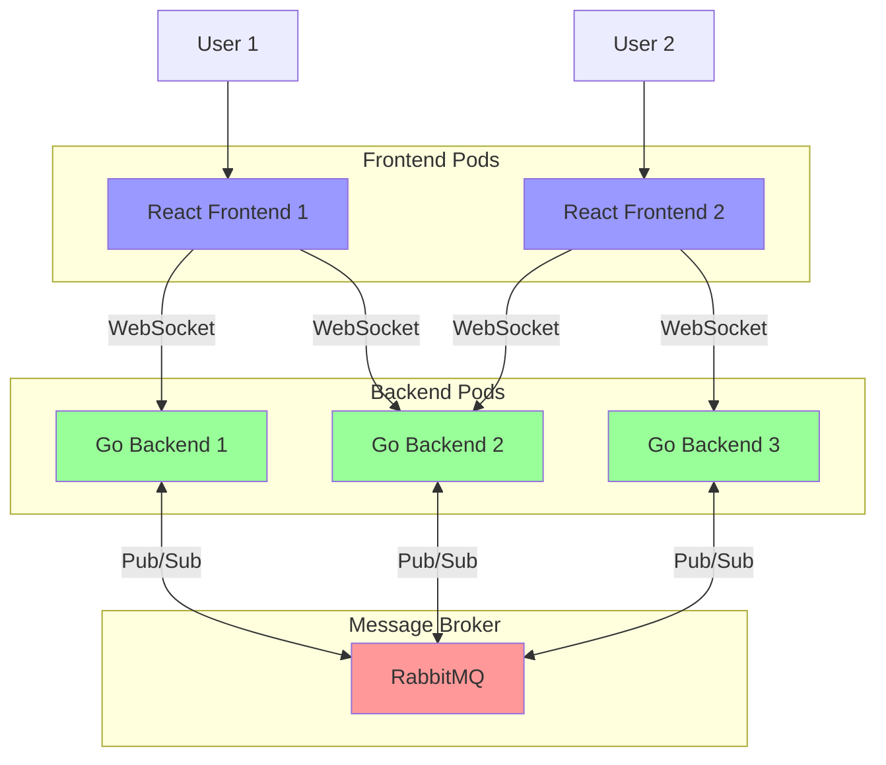
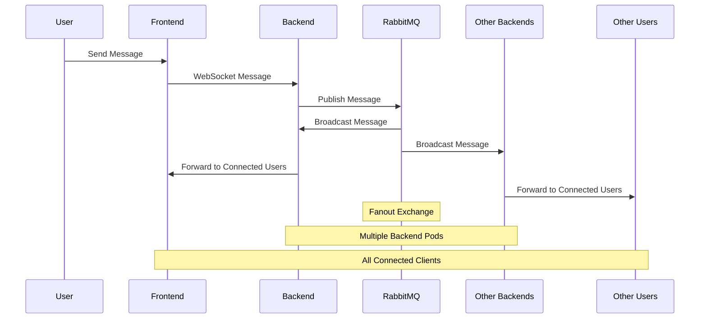
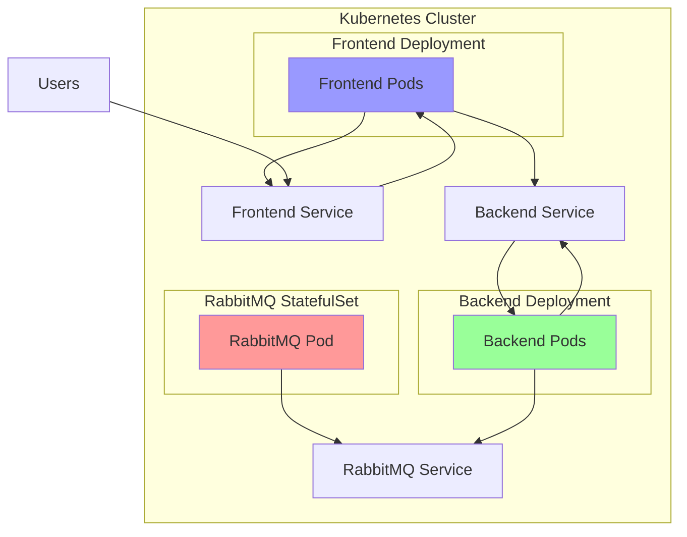

# Real-time Chat Application (Kubernetes Learning Project #3)

Part of a Kubernetes learning journey series, this real-time chat application demonstrates distributed systems architecture and container orchestration. Built with guidance from GitHub Copilot, this project showcases practical implementations of production-grade applications in a Kubernetes environment.

## Project Overview

This chat application is the third in a series exploring Kubernetes capabilities, focusing on:
- Real-time communication using WebSockets
- Message distribution across multiple pods using RabbitMQ
- Frontend/Backend service coordination in Kubernetes
- Container orchestration and scaling
- Service discovery and load balancing

The project serves as a practical example of how different components (React, Go, RabbitMQ) work together in a Kubernetes cluster, demonstrating real-world architectural patterns and best practices.

## System Architecture

### Component Interaction


### Message Flow Sequence


### Kubernetes Architecture


## Learning Objectives

- Understanding distributed systems in Kubernetes
- Managing stateful applications (RabbitMQ)
- Implementing real-time communication patterns
- Handling cross-pod message broadcasting
- Service discovery and pod-to-pod communication
- Load balancing and scaling considerations

## Features

- Real-time messaging using WebSockets
- Distributed message broadcasting via RabbitMQ
- Multiple backend instances with load balancing
- User count tracking
- Backend pod identification
- Automatic reconnection handling
- Cross-pod message synchronization

## Prerequisites

- Docker
- Kubernetes/Minikube
- Go 1.21+
- Node.js 18+
- npm/yarn

## Project Structure

```
chat-app/
├── chat-frontend/          # React frontend application
│   ├── src/
│   ├── public/
│   ├── Dockerfile
│   └── package.json
├── chat-backend/          # Go backend server
│   ├── main.go
│   ├── go.mod
│   ├── go.sum
│   └── Dockerfile
├── k8s/                   # Kubernetes configurations
│   ├── frontend.yaml
│   ├── backend.yaml
│   └── rabbitmq.yaml
└── deploy.sh             # Deployment script
```

## Installation

1. Clone the repository:
```bash
git clone [repository-url]
cd chat-app
```

2. Set up frontend:
```bash
cd chat-frontend
npm install
```

3. Set up backend:
```bash
cd chat-backend
go mod download
```

## Local Development

### Frontend
```bash
cd chat-frontend
npm start
```

### Backend
```bash
cd chat-backend
go run main.go
```

### RabbitMQ
```bash
docker run -d --name rabbitmq -p 5672:5672 -p 15672:15672 rabbitmq:3-management
```

## Kubernetes Deployment

1. Build and push Docker images:
```bash
# Update DOCKER_USERNAME in deploy.sh
./deploy.sh
```

2. Verify deployments:
```bash
kubectl get pods
kubectl get services
```

3. Access the application:
```bash
minikube service chat-frontend-service --url
```

## Environment Variables

### Frontend
- `REACT_APP_BACKEND_URL`: WebSocket backend URL

### Backend
- `PORT`: Server port (default: 3000)
- `RABBITMQ_URL`: RabbitMQ connection URL

## Architecture Details

### Frontend Components
- WebSocket connection management
- Real-time message display
- Connection status indication
- User count display
- Backend pod identification

### Backend Features
- WebSocket server
- RabbitMQ integration
- Message broadcasting
- Client tracking
- Health checks

### Message Flow
1. Client sends message via WebSocket
2. Backend receives and publishes to RabbitMQ
3. RabbitMQ broadcasts to all backend instances
4. Backend instances deliver to connected clients

## Monitoring

Check pod status:
```bash
kubectl get pods -w
```

View logs:
```bash
# Frontend logs
kubectl logs -l app=chat-frontend

# Backend logs
kubectl logs -l app=chat-backend

# RabbitMQ logs
kubectl logs -l app=rabbitmq
```

## Scaling

Scale backend replicas:
```bash
kubectl scale deployment chat-backend --replicas=3
```

## Kubernetes Concepts Demonstrated

- Pod orchestration and scaling
- Service discovery and networking
- Load balancing
- Container health monitoring
- Multi-container applications
- StatefulSet vs Deployment considerations
- Environment configuration
- Resource management

## Related Projects in the Series

1. [Project 1: Name and Description]
2. [Project 2: Name and Description]
3. This Project: Real-time Chat Application
4. [Project 4: Name and Description]

## Built With Help From

- GitHub Copilot for code suggestions and patterns
- Kubernetes community best practices
- Real-world architectural patterns

## Acknowledgments

- Built with React for frontend UI
- Go for backend services
- RabbitMQ for message queuing
- Kubernetes for container orchestration
- GitHub Copilot for development assistance
